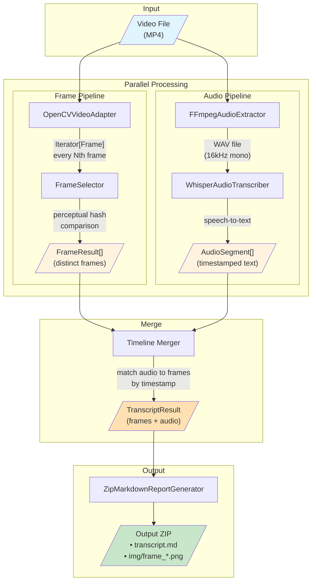

# Video Transcriber Dataflow

This document describes the data flow through the video-transcriber application.

## Architecture Overview

The application follows a **Hexagonal Architecture (Ports & Adapters)** pattern with parallel processing pipelines for frames and audio that merge before output generation.

## Dataflow Diagram

## Data Transformations

| Stage | Input | Output |
|-------|-------|--------|
| **Frame Extraction** | Video file | `Iterator[Frame]` (number, timestamp, BGR image) |
| **Frame Selection** | Frame stream | `FrameResult[]` (distinct frames via perceptual hashing) |
| **Audio Extraction** | Video file | WAV file path (temp file) |
| **Transcription** | WAV file | `AudioSegment[]` (start_s, end_s, text) |
| **Timeline Merge** | Frames + Audio | `TranscriptResult` (frames with associated audio) |
| **Report Generation** | TranscriptResult | ZIP with markdown + images |

## Key Components

### Ports (Interfaces)

- **VideoReader** - Reads video frames from file
- **AudioExtractor** - Extracts audio track from video
- **AudioTranscriber** - Converts speech to text

### Adapters (Implementations)

- **OpenCVVideoAdapter** - Uses OpenCV (cv2) for video reading
- **FFmpegAudioExtractor** - Uses ffmpeg subprocess for audio extraction
- **WhisperAudioTranscriber** - Uses faster-whisper for transcription
- **ZipMarkdownReportGenerator** - Creates output ZIP with markdown report

### Domain Models

- **Frame** - Single video frame with image data and perceptual hash
- **AudioSegment** - Timestamped text segment (start, end, text)
- **FrameResult** - Frame with associated audio segments
- **TranscriptResult** - Complete result containing all frames and audio
