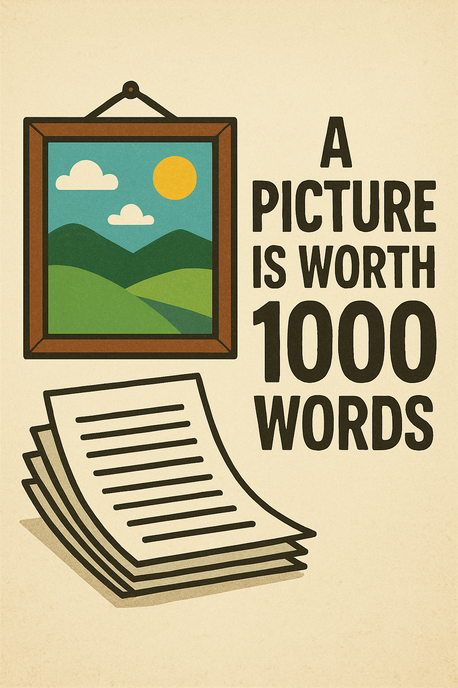

# Want to learn faster?

* Most of us read faster than presenters talk
* Video is engaging but slow
* Reading a document is faster, _but_



Markdown with images works well

# Video Transcriber

* Video Transcriber converts mp4 presentations to Markdown
* Detects slides and adds them as images
* creates a zip file with the markdown
  * linked to the images
* Open source, implemented in Python
* Runs on your PC

# Workflow

```
Video File (.mp4)
       │
       ▼
┌──────────────────┐
│ Frame Extraction │  ← Uses perceptual hashing to find distinct slides
└──────────────────┘
       │
       ▼
┌──────────────────┐
│ Audio Extraction │  ← Extracts audio track with ffmpeg
└──────────────────┘
       │
       ▼
┌──────────────────┐
│ Transcription    │  ← Whisper AI converts speech to text
└──────────────────┘
       │
       ▼
┌──────────────────┐
│ Timeline Merge   │  ← Associates speech with corresponding slides
└──────────────────┘
       │
       ▼
   Output.zip
   ├── transcript.md
   └── img/
       ├── frame_000.png
       └── ...
```

# Easy to use

```python
from video_transcriber.transcribe import transcribe_video

zip_path = transcribe_video("my-presentation.mp4", "output/")
```

