# Video Transcript

## Slide 1

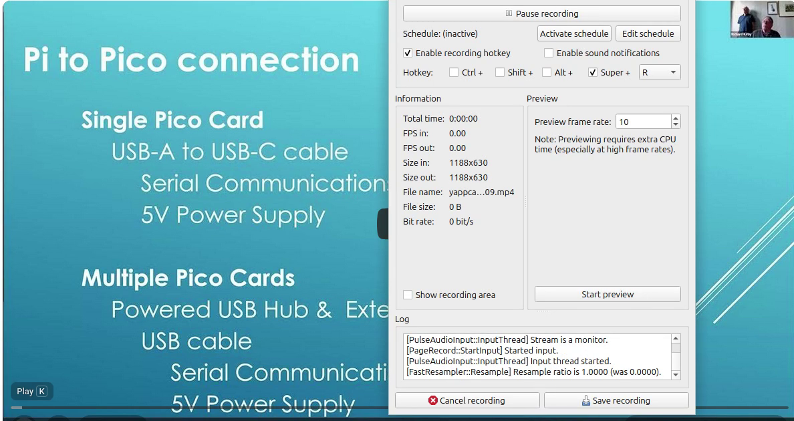

## Slide 2

## Slide 3

**Audio:**

- And I'm not getting up at that time in the morning. And I guess you guys can hear him okay.

- I'm going to get back to the hearing phone.

- So for the benefit people, I've been coming along to the.

- I was very upset.

- The Raspberry Pi group for about nine years now.

- I first started by when I was visiting London about nine years ago. I came along one night for a point and have participated by zoom ever since.

- Except that getting up at this time of the year. It's getting up at three thirty in the morning is a bit.

- It's a bit hard. So anyway, I'm in London. I'm visiting London for a few weeks. I thought we better come along again.

- So I, for those who don't know me, I, I worth an a factory in Australia as a manufacturer. We make cable.

- We, we start off with raw copper and make cable all the way up to, you know, a multi core complex hybrid cables, etc.

- And then turn them into the looms, which going to all sorts of appliances, caravans, automotive, etc.

- So we have this problem of building a loom and then wanting to test it.

- So you've got a, you've got a half a dozen cables, half a dozen wires, some connectors that each end.

- And you've got to make sure that when you're building thousands of them at a time.

- And we've done some of them where we've done not in batches of 10,000. It's really easy after a while to, to make a mistake.

- And when you're in mass manufacturing, when you make a mistake, you don't make one, you make a lot.

- And so what I'm showing here is a test set for testing cables and looms.

- Now, a, a loom can be just a simple, you know, three or four wires connected to each end. Very straight.

- But it could have a T piece of T, T connection in it. It could have multiple connectors.

- It might be connectors on one end and the other end might be just bare cut wires that are going to be cut stripped and then sold it into something.

- So we have all these combinations. So I'm, I'm looking at building the next generation of a Raspberry Pi controlling a series of IO devices.

- And so in this presentation, I'm talking about how I've used a pco or pco's.

- So what I'm checking for is, is swap wise. The, the person is assembling it.

## Slide 4

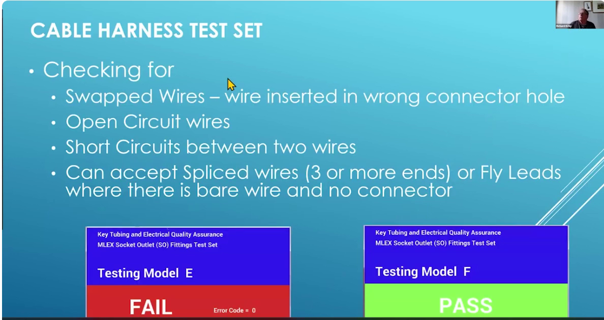

**Audio:**

- Let's put the wrong wire in the, in the wrong hole in the connector into the housing.

- We've got an open circuit. The pin hasn't been connected. Hasn't been pushed in fully and therefore won't form a circuit.

- We've got short circuits. The wires have been damaged and the insulation has been stripped off.

- And we've got a short circuit between two wires. And we can collect, we can accept spliced wires two or three or more ends and fly leads.

- And so at the very bottom is a typical screen we would run.

- And you'll notice it's, it's, it's this is sitting on a 22 inch screen in front of an operator who's testing.

- They don't need to look up. They can see their peripheral vision, either red or green.

- And, and they know there's no mistaking that they didn't read the test set.

- So, we've, we've got certain information about there. It's, it's what is the model are testing so that they know that the test program is correct for the product they're making.

- And they can quickly see.

- And then in the, in the red one where it says error code.

- We sequence the wires. If, if you had 10 wires in the, in the, in the loom, then it will be 10 from test zero to test nine.

- And they can tell which one of those of those 10 wires is creating the fault.

- And traditionally we've, we've used and something like 10 years ago we started off using an ncp 23 017, which is, which is an 8 bit device.

## Slide 5

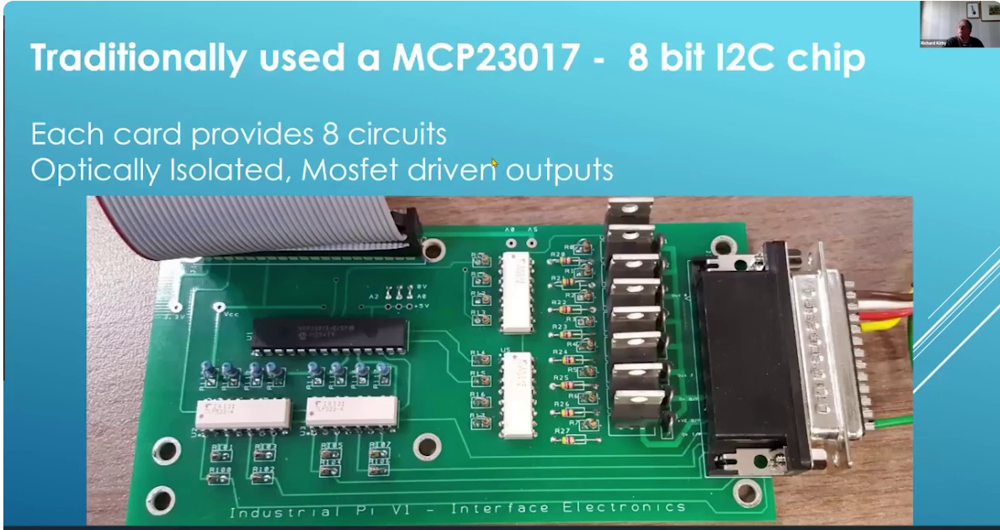

**Audio:**

- It's got two 8 bit parallel ports on it.

- And we would wire them up as eight out and eight in. And so it gave us each card gave us eight collections.

- So if you, if you're like a loom with say 10 wires, it's got 20 points.

- We had to have multiple of these cards to, to do a simple 10 wire loom.

## Slide 6

**Audio:**

- And so the thing is we would start stacking them up.

## Slide 7

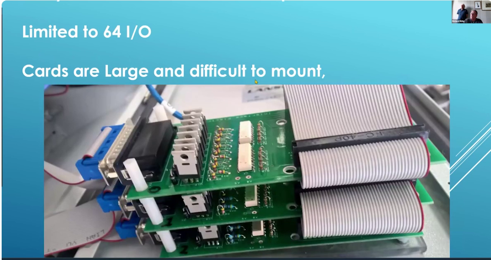

**Audio:**

- They're large, they're difficult to mount.

## Slide 8

**Audio:**

- And look, we've got back the difficult amount and limited to 64 IO.

## Slide 9

## Slide 10

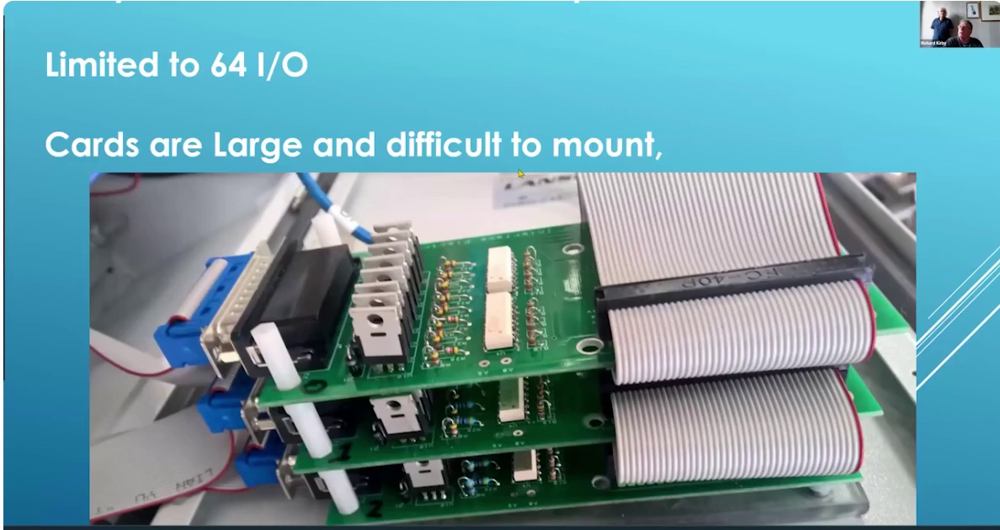

**Audio:**

- So effectively it limits us to say 32 wire loom.

- We've got jobs coming up where we're doing 120 wire looms.

- So we're going to have to start putting switching in I squared, so he's switching.

- And so there's another, there's another way of doing it. There's a p go.

## Slide 11

**Audio:**

- So it's a 23 50 B, which is not distributed through the Raspberry Pi foundation.

- It's, it's, it's the second source supplier.

- So it's, it's a stamped version.

- I bought it out of solder party in Sweden.

- And it gives me 40, it's got about 43 IO and I'm using 40.

- And I put up the first 20 on the first on the bottom DB 25.

- And the second 20 on the top DB 25.

## Slide 12

**Audio:**

- And it's, and, and this particular card has been set up by solder party to work in circuit Python.

## Slide 13

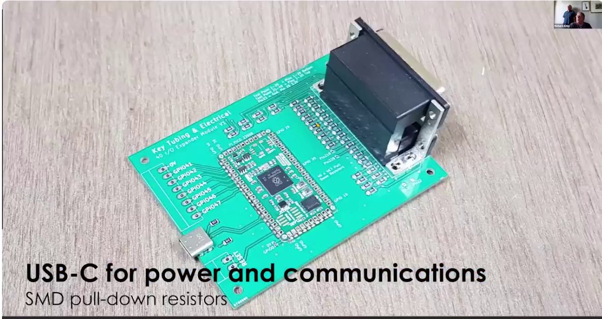

## Slide 14

**Audio:**

- So wherever you use pecos before when micro Python.

- I had to come across and use circuit Python for this one.

- So it's USB C powered.

## Slide 15

**Audio:**

- And I simply just put a cable between the Raspberry Pi and, and this card, the Pi powers it and communicates with it.

- And you'll see a series of pull down resistors behind the DB 25 connectors.

- That's associated with this issue that the, the Pico has got where it doesn't properly pull down.

- So I added my own pull down resistors.

- And, and, and read about that literally days before I committed these PCB.

- So it was a quick, a quick redesign.

## Slide 16

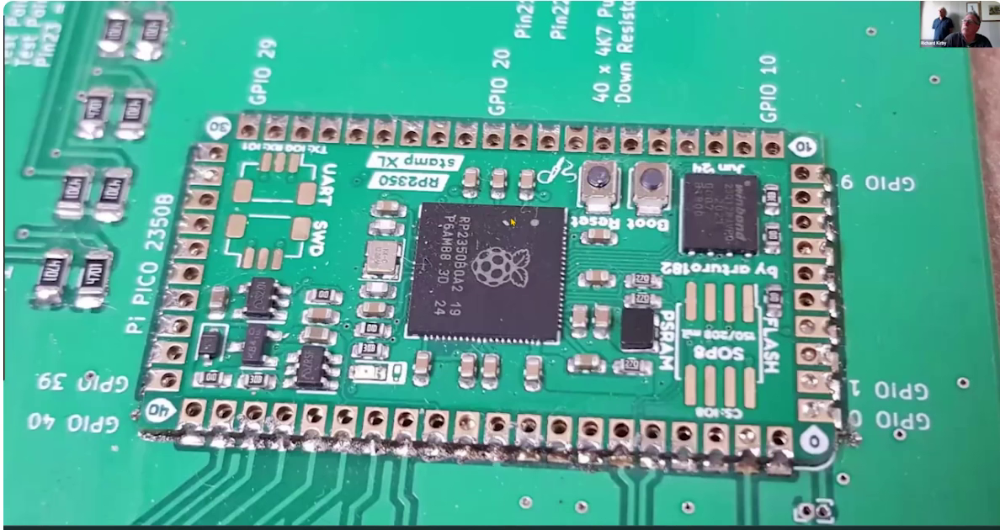

**Audio:**

- And so you can see what I was able to do is through circuit Python assign the GPIOs around starting any clockwise,

- starting the bottom right hand side.

- And just GPIO 01 through all the way up to the diagram called GPIO 40.

- In fact, that's 41 IOs.

- And I actually, this, this idea of counting from zero drives me nuts.

- So I got 41 IO and I go from GPIO 1 GPIO 40.

- I understand the reasons why and all of that.

- So I can support it.

- So if I can get a further, I do.

## Slide 17

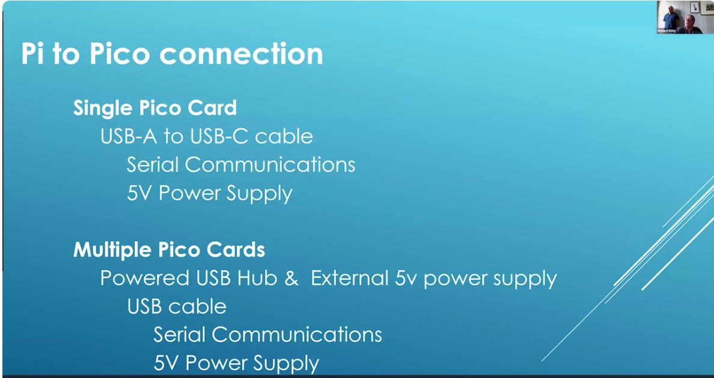

**Audio:**

- So the connections are simply a USB C on the, on the Pico to a USB A on the, on a, on a, on a Pi.

- And if I've got multiple of these up to 10.

- Because I put it through a USB hub.

- And I've got an externally powered power supply feeding a, an externally powered USB hub.

- I've got the power, the power, the, the five volts to the Picos.

- And the, and the communications is through the hub back to the, to the Pi.

- And that, that works fine.

- And so the, the, the pod I'm running in the, in circuit Python is, is simply this.

- I, I, I configure the, all the IOs as, as, as inputs.

- And I just poll the serial port.

- And I'm looking for commands.

- And you can see there.

- It's, it's saying here else if data and lower says just put everything to lower case.

- Equals read.

- So there's a, I will send it.

- The, the Pi will send us four character string.

- Read.

- And the Pico will go off and read all the IOs.

- Here and send it back with a simple statement.

- Print the, the read function.

- If I say clear read it will turn all the inputs or all the IOs to inputs and then read.

- Because I may have had, or I don't know the state of some of the, whether I've turned some of the IOs into output.

- And so I just turn them all to inputs and then read it.

- And I have a series of commands, which I'll show a bit later.

- The, the, since in, in the Pico that responds to the appropriate commands sent by the Pi.

- So the read command is nothing more than I set up a, a variable with.

- Strange this 41 data elements.

- And I count from, and I read from one to 40.

- Well, what I'm also doing is I'm sending back in the, the, the first byte, a value of five.

- So when I've got 10 of these hanging off a Pi, I don't want to have to go and read every input of, of, you know, 400 inputs to work out which one is, is a one in which ones are zero.

- Because it'll be a sparse matrix coming back, I can ignore it by just looking at that first variable.

- I can tell whether the anything in that whole part is zeros.

- If they're all zeros, I'll just move on just by looking at that one, that one variable.

- And then I just return the function value back to the.

- And, and though the simple commands that I'm running, I've got turn all the in or turn all the inputs to input read clear read, which is turned into inputs and then read.

- Outread is turned one output on and then read.

- And I can, what I'm doing is I'm sequentially going around this loom, turning one output on at a time and seeing what else comes on.

- I can turn just turn one output on.

- And I can also check here, I just check all the inputs are logical zero.

- And that's as simple as that.

- And the rest of the processing is done in the pie.

- And then the pie, all I've got is a, as I'm just using pie serial.

- And I send serial command, I send it out and then read what, I just read back what the thing up, what the pco sends back.

- So it's a very simple communication.

- The pie is, is, is controlling and the, and the pco is responding.

- It's just polling around.

- And, and I can do a single card several hundred times a second.

- Even in pie, you know, even in circuit Python, it's fast.

- But I do have the capability of putting this all in, in machine code and then compiling it.

- I really want it to go faster. But at this stage, I, I'm not needed to.

- It's more than adequate.

- So it's, it's as simple as that.

- And if anybody wants more detail on what my code is in the pie, I mean, you can talk to me outside of this meeting.

- And I'll happily share bits and pieces really.

- And if there's any questions.

- I mean, what there's a bad joint is.

- So I'm not, I'm not testing for.

- I'm not injecting current. So some, some loans we do, we might need to inject 10 amps and then do Volleystroke tests.

- We're not doing that.

- We're simply doing a continuity test.

- Have I got the right pins connected to the, in each connect them.

- Assuming the resistance is, is, is low.

- And now a lot of these looms are actually put to get, these are, these are all machine crimped wires too.

- We don't hand crimp anything.

- And you get higher reliability with machine crimped either, either a machine that will do.

- I mean, we can, we can take a wire and take, you know, a thousand meter roller wire.

- Put it into a machine that will cut it into say, I don't know, a meter length, five hour of meat, millimeter as long.

- Cut the wire strip both ends, put terminals on the, on the end and do it under a second and pump them out fast.

- Or we can do them by hand, you know, you know, sort of feeding in one other time into a machine.

- But either, either method is highly reliable, they're extremely consistent.

- So the idea of saying, am I looking for one crimp that's been a bad joint.

- I've eliminated that through the, the manufacturing method.

- So this test set doesn't need to, is not designed to go looking for resistance in joints.

- So some, so humans, what, where they're doing that.

- So when you put, get all the wires crimped from both ends, and then you, they put into connectors or what, what the humans actually aren't humans going involved in the process.

- So yes, it's taking, taking a, maybe say 10 wires in 10 boxes in front of you.

- And, and connecting them in the right sequence, right in the right combination.

- And it's a 10 wires in one cable, or how does it?

- Yeah, so it might be, so it's a, so it's a simple, you know, two connectors and 10 wires between them.

- You know, it might be pin one to pin three and there might be combinations.

- Or it might be, you know, a 10 way connector on the end and two five way connectors on the B end.

- Yeah. And so it'll be a Y shape cable.

- And how did we, sort of the pie has the, the sense of the wiring diagram?

- Yes.

- It's the result.

- Yeah. So we know what we should expect.

- And we're going to compare us in between what we're getting and what we expect.

- Right.

- Now, we can actually put the thing into self-teach mode.

- And as long as you're confident what you're actually putting as a master sample is correct.

- Because every time you do a master sample with the correct wire, you also do master samples with faults in them.

- Right.

- Deliberately doing that setup time.

- You actually go and check that you see a correct master sample.

- And you also see the errors.

- So you can do a master sample and say, okay.

- Just see all the data.

- Feed it back and say, here's your, here's your table.

- Yeah.

- Right now, you can build its own true table because you should plug the master sample in and tell it to learn.

- Okay.

- This is an AI.

- It's just sort of like just figures it out.

- Yeah.

- Right.

- Or I'll sit there and do it manually.

- It doesn't matter.

- Yeah.

- Maybe the way.

- And of course, what I don't have here is showing us.

- We do have a pie that actually shows you want to screen which way to put where and.

- And I'm working on with a camera to actually check that you actually did put the right wire in the right hole.

- And I'm going to be able to do a paneling of the trims themselves.

- I guess you just connect like a.

- In the middle of the middle together and just make sure we're all.

- So we might be making a while.

- I loom that might be say, you know, a meter long.

- They'll have sort of you know on the A N might have a plug on the on the B N's that might have two sockets or whatever.

- And so.

- You're also testing that you've actually got the right housing on each end.

- You haven't put two plugs on or.

- There are some.

- Some of the plugs called it as well.

- So you've got to check the coding by just.

- And so what I will do is always put it on the test brick is a mating half.

- So if you've got a plug, I've got a socket on the test set and you've got to put it in.

- You can check that it's not in backwards or upside down and.

- So that's what the humans do.

- No, no, no, no, the test set will do that as well.

- Oh, OK.

- And sometimes I.

- That's a bit of a bot, but the test center is that.

- No, this is the test set.

- OK.

- But also instead of using a connector to connect.

- I might actually put a board with Pogo pins on it.

- And you're checking out the pins are fully correctly inserted to the right depths.

- Right.

- And we've checked.

- We do that when you've got an earth pin on a on a mains device.

- You want to make sure the mains.

- The earth pin is one or two mill four to the active and neutral pins.

- To make sure the earth connects first.

- And so we will use Pogo pins for that.

- I'll run by the same.

- Yeah.

- Yeah.

- So it's just one.

- One part of the whole.

- Yeah.

- My starting machine.

- So this, this presentation is about how do I get all these IOs.

- When you, you got hundreds of IOs.

- You know, into a pie.

- And so I'm using using Picos to do that.

- Yeah.

- So what's your cost for bored then?

- With the.

- Since I'm doing all the soldering and all the.

- The Picos.

- Even that Pico is.

- You know, I'm just converting it to pounds now.

- It's probably five or six pounds.

- Right.

- You know, the circuit board is.

- Oh, less than a dollar.

- Right.

- I haven't made it to be 25.

- I was going to express it.

- Yeah.

- Probably 20 plus.

- It's probably $10 or $20 worth it.

- Fight for, you know, probably 10 pounds worth.

- So when would be 25?

- It's just something you just used to.

- You just use a lot of them or something.

- No, that particular ones double stack.

- So it gives me two of them.

- Right.

- And it's.

- So it's it's all in one.

- So you just.

- Okay.

- You plug it in.

- Sorry.

- Soldered in in one piece.

- So if you go.

- Go back.

## Slide 18

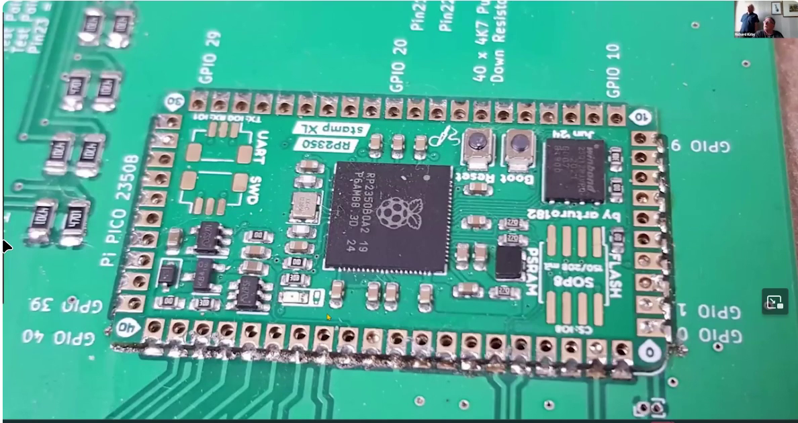

**Audio:**

- You can see that this thing is stacked.

## Slide 19

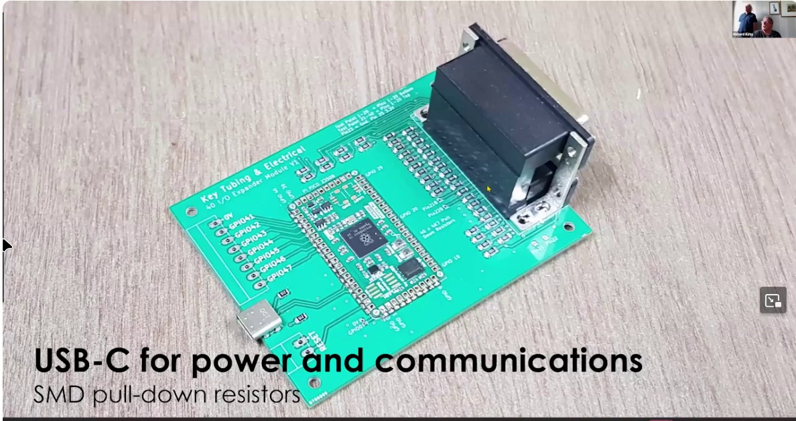

**Audio:**

- Okay.

- It's physically one.

- So.

- Otherwise,

- if you had two separate ones,

- this.

- This top one would be levering on the solder.

- And you run the risk of factoring the solder.

- Right, right.

- This.

- This bracket that it's part of the connector.

- Yeah.

- It's got some spring clips that poke through the holes in the board.

- And you solder them in.

- Yeah.

- So that takes the mechanical load.

- Great.

- They're all on the gas on the GPIO pins.

- There's a leakage problem with the original.

- Because they will only pull down to about one volt.

- Because it's excessive leakage current from.

- From part of the circuitry.

- So they.

- They can fix it when they do that.

- The next upgrade to the.

- Sold other.

- The PC and not the PC.

- The chip masking.

- And that will get fixed in time.

- So I just put them in.

- There's a quick and dirty.

- Work fine.

- Okay.

- So how does the price of this comparator your previous solution?

- Oh, much cheaper.

- The previous one.

- Well, the real issue here is.

- You're in this thing.

- It's the.

- It's the.

- It's the.

## Slide 20

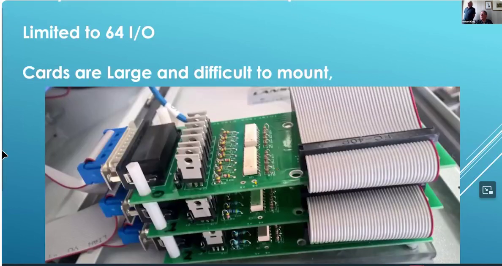

**Audio:**

- It's the.

- It's the.

- It's the.

- It's the time that it takes the solder.

- All these through hole connectors through.

- And then.

- The.

- The cabinet.

- You end up with a.

- A big steel box.

- You end up putting the whole thing in.

- Right.

- And.

- And you know, and ribbon cables and connectors.

- And.

- I got concentrated boards to take, you know,

- three of them into one.

- It's connection.

- And.

- It just gets out of hand.

- Use a lot of.

- Are you having full of you?

- No, no, no.

- Yeah.

- Okay.

- So.

## Slide 21

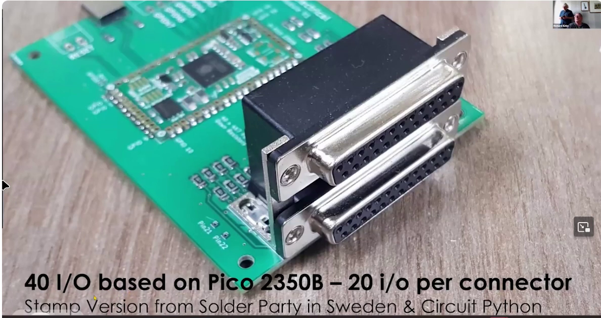

**Audio:**

- I thought, let's take a risk here.

- I'm.

- I'm.

## Slide 22

**Audio:**

- I'm.

- I'm.

- I'm.

- I'm.

- I'm.

- I'm.

- I never take three point three volts.

- Outside of the outside of the.

- The.

- The main of the.

- The.

- The.

- The pie.

- So this.

- This thing works on 24 volts.

- Imports and 24 volt outputs.

## Slide 23

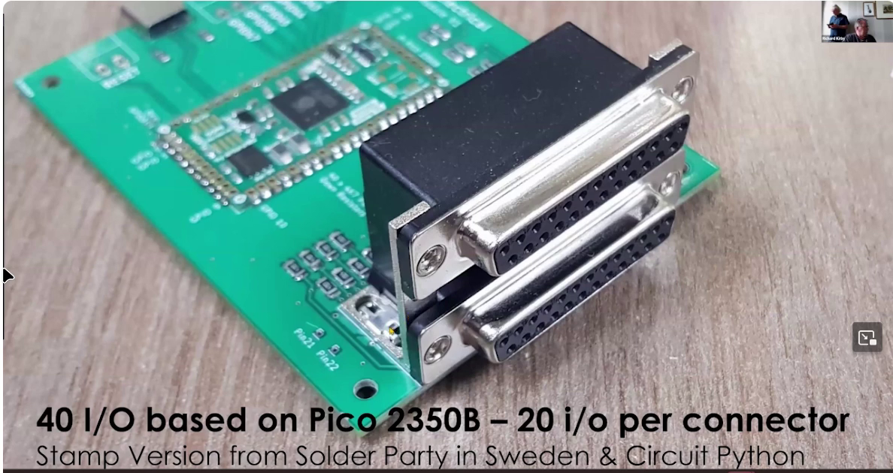

**Audio:**

- Fully optow coupled.

- Imports and outputs.

- So I completely broke that rule.

- And I take the three point three volts.

- Off.

- I have lost one or two of them so.

- I might need to put a bit of trends, I think it's static

- from the operator when they're plugging in a very long loom.

- I'm talking about something that's like 15 meters long,

- and they've walked this loom up along the table

- and I think they've generated static.

- And as they've plugged it in, I think they've zapped the board.

- Oh, I've lost two of them in six months.

- And coming away, I've left 10 spears.

- I hope they last, but I think what I have to do

- is put some, probably some transient suppression across

## Slide 24

## Slide 25

**Audio:**

- here as well.

- Right.

- Big picture.

- Awesome.

- Oh, yeah, yeah, but the size of this

- and the, the smarts of the PGO are so attractive,

- I'm prepared to persist with this,

- and actually solve it rather than abandoning it now and saying,

- it's not the way to go, I'll go back to the old way.

- So what makes you go with that?

- Well, it's standard, it's standard.

- IOs.

- So you suddenly have fewer published IOs.

- So this one here, I get 40 IOs out of it,

## Slide 26

**Audio:**

- because it's the 2350 beam.

- Yeah.

- I get extra IOs out of that.

- I think I'm going to get 32 or something out of this standard.

- So I'm 2350 A, something like that.

- Thereabouts.

- And I wanted to get up to an even, I didn't,

- I wanted to get up to 40.

- They're available through these second source, you know,

- supply.

- The cost is cost difference is negligible.

- And it gets me up from say 30 up to 40.

- So I went that way.

- So return investment has to be huge.

- I mean, some of the tasks are relatively complex,

- the loom, I'll be spending an hour or two if they can have this.

- Oh, no, we could, we could test the loom in in 30 seconds.

- Yeah, with this.

- Oh, with this.

- The human is doing some, if you throw there forever.

- Well, no, the problem is not time with the human.

- It's the errors they make.

- People have a known error rate.

- Yeah.

- And when you mass produce something,

- you multiply that error rate by the number you've made.

- Yeah.

- And you multiply that by the expense per unit of what,

- what's the downstream consequence of it?

- Yeah.

- It gets frightening.

- Well, just recently, I screwed up a loom.

- I'm trying to say that.

- Yeah, what's, you know, depending what you're controlling.

- Cool.

- That's really good.

- So any questions online?

- If there's any questions in the chat, I didn't see any.

- But I'm a bit behind.

- One of the frequency requirements of your loom.

- Sounds like all the questions you need.

- It's primarily DC.

- We're not, we're not doing RF.

- We're not doing Kalex cables.

- I would test them a different way.

- This is purely a, a very low frequency, you know,

- switching, you know, switching power enough to light.

- So if it's an automated loom, you know,

- it's on a trailer, it's switching the turning lights on and off.

- That would be the highest frequency.

- Right, right.

- And what version of PCV area on?

- That's rev two.

- It's pretty well what we're sticking with for now.

- Yeah.

- And rev one didn't have the pull down resistors.

- OK, that's only different stuff.

- Yeah.

- So it didn't make any major errors and they're falling

- further than one.

- I use quiet cat.

- I'm so used to it.

- It's brilliant because you don't leave things out.

- You know, you know, I do, I run error checking and all that.

- And what do you suppose these things?

- Is it the steel box or do you put in the three?

- No, but it's stuck on the underneath of the work table

- with a bit of double side of tape.

- Oh, nice.

- Hey, oh, this is engineering, it's how you do it.

- Nice.

- Well, any other questions?

- I want to come off news and ask a question.

- Oh, good.

- How many of these do you need?

- The cripples and the lead go faster than the cripple or you could

- mountain them up.

- Yeah, yes.

- Thanks for.

- No, so it's in second.

- No, we can do assembly time is longer than test time.

- Yeah.

- Yeah.

- But actually, what the time is, if I have one of these in a factory,

- you need to take your product from your workstation across to the test station.

- It's the travel time going there and back.

- And so the attraction for this is,

- I can put this in the back of a touchscreen pie.

- So a seven inch touchscreen with a pie and this one or two of them behind it

- is a very lightweight self-contained test set

- and that I can put on mobile workstations.

- They're not going to fall 10, but just one or two of them.

- And that's something I'll be doing when I get back.

- Very cool.

- Oh, there's no more questions.

- Thanks very much, Tony.

- It was really interesting.

## Slide 27

## Slide 28

## Slide 29

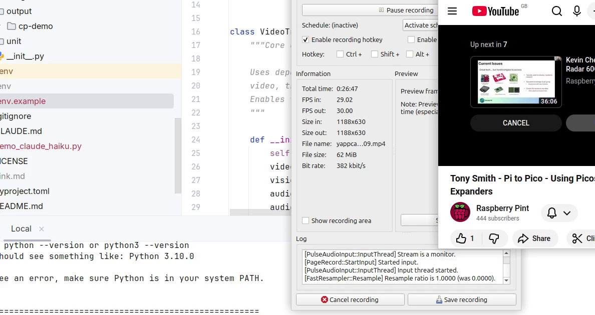

## Slide 30

## Slide 31

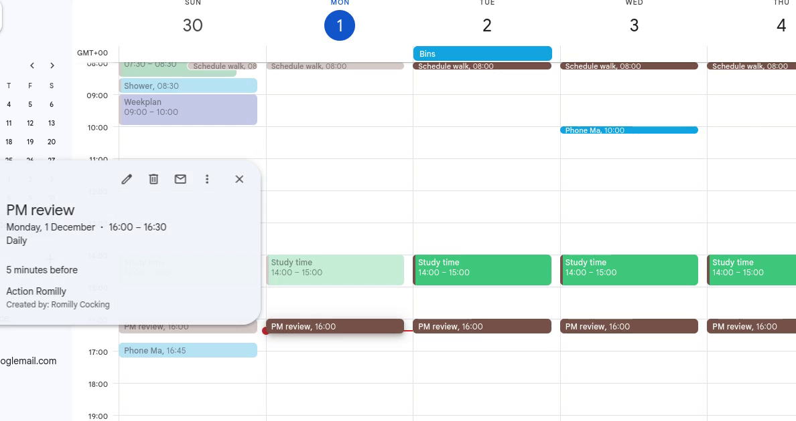

## Slide 32

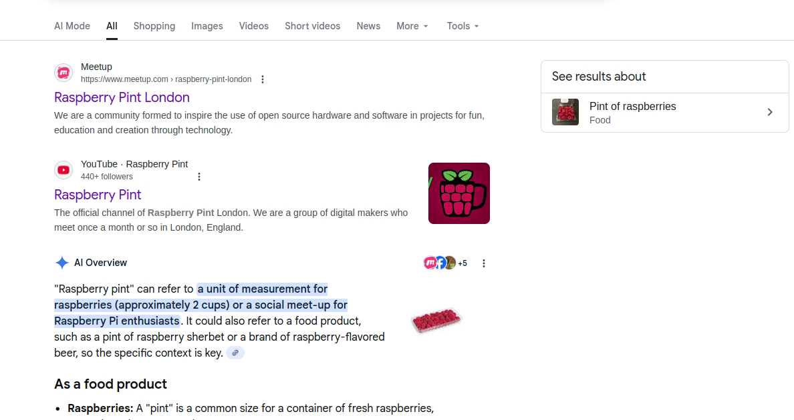

**Audio:**

- This video was created by AI.

## Slide 33

## Slide 34

## Slide 35

## Slide 36

## Slide 37

**Audio:**

- No expensive cameras or complicated software with the right tools.

## Slide 38

## Slide 39

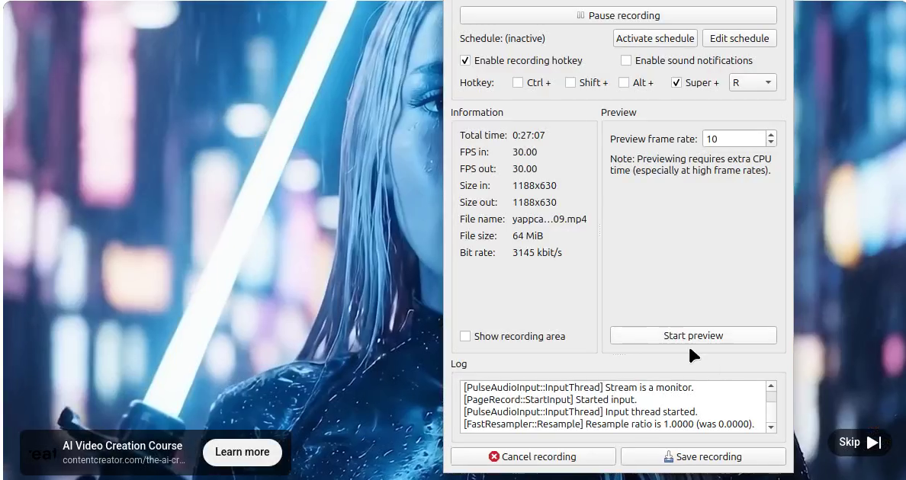

## Slide 40

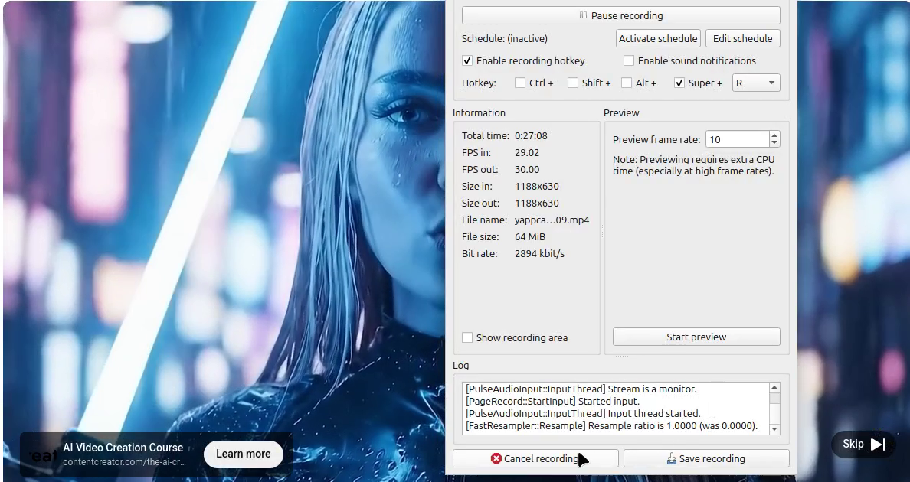

